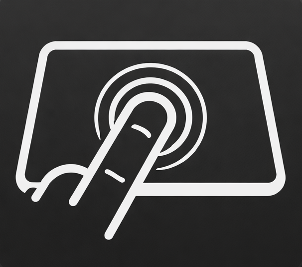

<p align="center">
  
</p>
# TouchBro

Minimal Apple Silicon native menu bar app that maps a **trackpad force click** to a configurable keyboard shortcut (default: `Cmd+C`).

Completelly free and opensource

Inspired by [BetterTouchTool](https://folivora.ai/).

## Features

- Menu bar app with a single settings window.
- Force-click detection via `MultitouchSupport` Apple's private framework.
  > [!NOTE]
  > **What is `MultitouchSupport`?**
  > It is a private macOS framework that provides low-level access to raw trackpad data. While standard macOS APIs only report high-level "Force Click" gestures (usually tied to Look Up), TouchBro uses this bridge to read the actual pressure (force) values from the trackpad sensors directly. This allows it to trigger shortcuts globally and instantaneously, even in apps where the native OS gesture is disabled or blocked.
- Configurable shortcut key + modifiers.
- Autostart toggle.
## Install — Remove Quarantine

If the app was downloaded/copied and macOS flags it as quarantined:

```bash
xattr -dr com.apple.quarantine /path/to/TouchBro.app
```

If installed in `/Applications`:

```bash
xattr -dr com.apple.quarantine /Applications/TouchBro.app
```
## First Run

1. Launch the app.
2. Open **Settings** from menu bar.
3. Click **Request Accessibility** and grant access in System Settings.
  > [!IMPORTANT]
  > **Why Accessibility?**
  > macOS requires apps to be "trusted" (granted Accessibility permission) to do two things:
  > 1. **Read selection:** Silently query the text you have highlighted in other apps.
  > 2. **Simulate keys:** Send synthetic `Cmd+C` or other keystrokes on your behalf.
  > TouchBro never records your keystrokes or sends data anywhere; it only uses this to bridge your force click to the copy shortcut. App has no internet access.
4. Return to TouchBro.

## Local build

From repo root:

```bash
./package.sh
```

This builds a release binary, assembles `TouchBro.app`, signs ad-hoc, creates `TouchBro.dmg`, and launches the app.